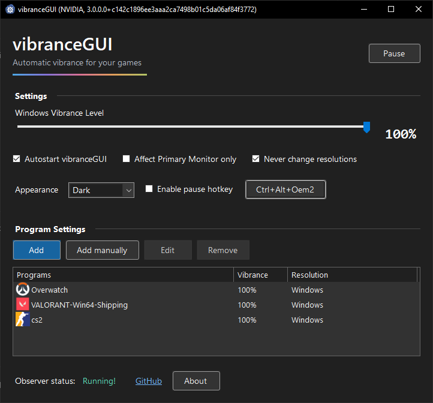
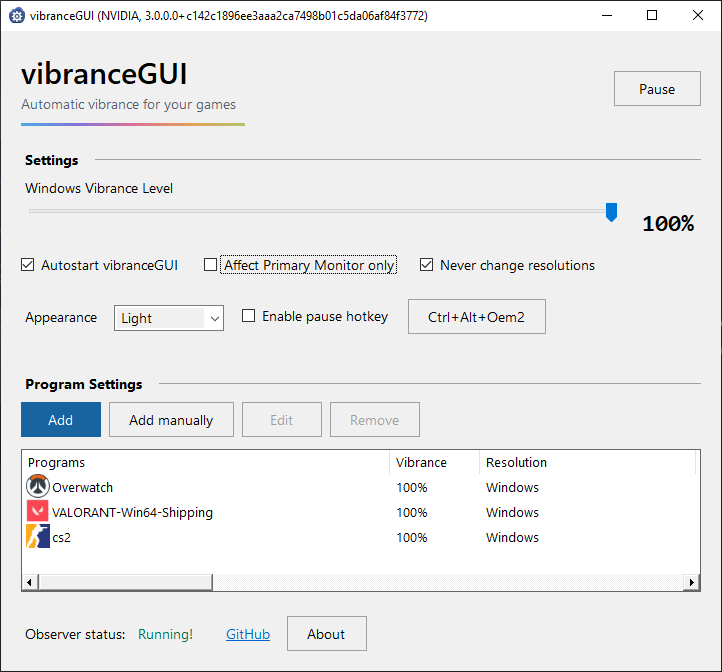

# vibranceGUI

vibranceGUI adjusts NVIDIA digital vibrance or AMD saturation when you switch to a game, then returns to your desktop level when you switch away.

This is [SteffenCarlsen's fork](https://github.com/SteffenCarlsen/vibranceGUI) of [juv / juvlarN's vibranceGUI](https://github.com/juv/vibranceGUI), updated with modern GPU support, .NET 10, light and dark themes, and a configurable pause shortcut.

**[Releases](https://github.com/SteffenCarlsen/vibranceGUI/releases) · [Report a bug](https://github.com/SteffenCarlsen/vibranceGUI/issues) · [Changelog](#changelog-since-the-original-project)**

| Dark mode | Light mode |
| --- | --- |
|  |  |

## Getting started

You'll need **Windows 10 or 11 (x64)** and a display connected to a supported NVIDIA or AMD GPU. The portable executable includes .NET 10, so there's no separate runtime to install.

1. Close any other copy of vibranceGUI and run `vibrance.GUI.exe`.
2. Set **Windows Vibrance Level** to the level you want on your desktop.
3. Choose **Add** to pick a running program, or **Add manually** to browse for an executable.
4. Double-click a profile to set its game vibrance and, if you want, its resolution.
5. Enable autostart or the pause hotkey if you'd like to use them.

Minimizing sends the app to the tray. **Pause** restores your desktop settings; **Resume** applies the profile for the current program. Exiting restores the displays the app changed.

## Profiles and monitors

A profile is active while its program is in the foreground. The app matches the executable path when Windows makes it available, with a process-name fallback for protected programs. If a program doesn't appear in the running-program picker, add its executable manually.

**Affect Primary Monitor only** limits vibrance changes to your primary monitor. Resolution overrides always apply to the foreground window's monitor, independently of that option.

Leave **Change Resolution when Ingame** unchecked to keep the game's own resolution and refresh rate. To disable all resolution overrides, select **Never change resolutions**. The app checks requested modes before applying them and restores the previous mode when you switch away.

## Appearance

Choose **System**, **Light**, or **Dark**. System follows your Windows app theme, and changes take effect immediately. Windows high contrast takes priority.

## Pause hotkey

Check **Enable pause hotkey** to use **Ctrl+Alt+V**, or click the shortcut button to record a different combination and choose **Save**.

Use Ctrl, Alt, or Shift with a key, or a function key on its own. F12 is reserved by Windows, and Windows-key combinations aren't supported. If another app has already registered your choice, vibranceGUI keeps the previous shortcut and lets you try another.

## Autostart

Autostart launches the app in the tray when you sign in. It applies only to your Windows account and doesn't need administrator rights. Uncheck it to turn it off.

If you move the executable, run it once from the new location to update the autostart entry. Any explicit `--adapter amd` or `--adapter nvidia` choice is kept.

## GPU support

vibranceGUI checks the displays connected to your GPUs for digital vibrance or saturation control. Having both NVIDIA and AMD drivers installed is fine; you don't need to remove your integrated-graphics drivers.

| Setup | What to expect |
| --- | --- |
| NVIDIA | Uses NVAPI from your installed driver. Digital vibrance availability depends on the driver. |
| AMD | Uses ADL2 for displays that expose saturation control. |
| NVIDIA and AMD monitors together | Color control uses one vendor at a time, preferring NVIDIA automatically. Start with `--adapter amd` to use AMD instead. Resolution profiles work independently. |
| Laptop / hybrid graphics | Support depends on the GPU connected to the display, which may differ from the GPU running the game. An external monitor can have different support from the built-in panel. |
| Intel-only display | Intel saturation control isn't supported. |

NVIDIA's **Override to reference mode** can bypass color adjustments. HDR behavior hasn't been verified, and automatic SDR/HDR profiles aren't available.

**Restart the app after connecting a new monitor or changing GPU/display routing** so it can refresh its display and resolution lists. Hardware test results are in [VERIFICATION.md](docs/VERIFICATION.md).

## Command-line options

| Option | Purpose |
| --- | --- |
| `-minimized` | Start in the tray. |
| `--adapter nvidia` | Use NVIDIA. |
| `--adapter amd` | Use AMD. |
| `--diagnostics <file.json>` | Save a read-only GPU and display report. |

For example:

```powershell
.\vibrance.GUI.exe --diagnostics .\gpu-diagnostics.json
```

Diagnostics leave your display settings unchanged. Reports include device and monitor names, so check the file before attaching it to an issue.

## Settings and recovery

| File | Stores |
| --- | --- |
| `%APPDATA%\vibranceGUI\vibranceGUI.ini` | Desktop vibrance and monitor/resolution options. |
| `%APPDATA%\vibranceGUI\applicationData.xml` | Program profiles. |
| `%LOCALAPPDATA%\vibranceGUI\appearance.json` | Theme and hotkey preferences. |

Existing settings from the original app carry over. Both versions use the same settings files and allow only one copy to run at a time.

Saving profiles keeps the previous file as `applicationData.xml.bak`. If a profile file can't be read, the app reports it and leaves it alone; editing profiles first preserves the unreadable file as a separate `.corrupt` copy.

To restore a working backup, exit the app, keep a copy of the broken file, and copy `applicationData.xml.bak` to `applicationData.xml`.

## Build and verify

Building requires Windows and the [.NET 10 SDK](https://dotnet.microsoft.com/download/dotnet/10.0).

```powershell
dotnet build .\vibrance.GUI.sln -c Release
dotnet run --project .\checks\vibrance.GUI.Checks.csproj -c Release
.\scripts\publish.ps1
```

The portable executable is written to `artifacts\win-x64\vibrance.GUI.exe`.

For the UI checks and preview images:

```powershell
dotnet run --project .\checks\vibrance.GUI.Checks.csproj -c Release --no-build -- --theme-switch .\artifacts\theme-switch
dotnet run --project .\checks\vibrance.GUI.Checks.csproj -c Release --no-build -- --hotkey-ui .\artifacts\hotkey-ui
dotnet run --project .\checks\vibrance.GUI.Checks.csproj -c Release --no-build -- --dropdowns .\artifacts\dropdowns
dotnet run --project .\checks\vibrance.GUI.Checks.csproj -c Release --no-build -- --render Dark .\artifacts\ui-dark.png
dotnet run --project .\checks\vibrance.GUI.Checks.csproj -c Release --no-build -- --render Light .\artifacts\ui-light.png
dotnet run --project .\checks\vibrance.GUI.Checks.csproj -c Release --no-build -- --render System .\artifacts\system-theme\startup.png
```

These previews use simulated GPU backends and leave your settings alone. To check native shortcut registration, run:

```powershell
dotnet run --project .\checks\vibrance.GUI.Checks.csproj -c Release --no-build -- --hotkey-native
```

The [Windows workflow](.github/workflows/build.yml) builds, checks, and publishes the executable. Successful pushes to `master` also create a GitHub release with the executable, `SHA256SUMS.txt`, and commit notes. Pull requests and manual runs produce [workflow artifacts](https://github.com/SteffenCarlsen/vibranceGUI/actions). Release tags include the app version and source commit, which you can also find in **About**.

## Support and contributing

[Open an issue](https://github.com/SteffenCarlsen/vibranceGUI/issues) to report a bug. Include your app and Windows versions, GPU and driver details, and the steps to reproduce it. For display problems, mention the affected monitor, HDR settings, and any resolution override. A diagnostic report can help too.

[Pull requests](https://github.com/SteffenCarlsen/vibranceGUI/pulls) are welcome. The [upstream issue review](docs/UPSTREAM_REVIEW.md) covers the original bug reports and ideas behind this update.

## Changelog since the original project

### 3.0.0.0 — 2026-10-04

1. **Runtime:** moved from .NET Framework 4.0 to .NET 10, with a portable Windows x64 build that includes the runtime. Added automated builds, checks, and releases.
2. **GPU handling:** replaced the old NVIDIA wrapper and AMD bindings with direct NVAPI/ADL2 integration. Added support for mixed-driver setups, explicit adapter selection, and more reliable restoration when switching programs, pausing, or exiting.
3. **Profiles and settings:** improved program matching, reduced repeated driver calls, and fixed resolution changes on mixed-monitor setups, including scaling-only changes. Added profile backups, recovery for damaged settings, and a more responsive program picker.
4. **Interface:** refreshed the windows and dialogs, added System/Light/Dark themes, and fixed Windows 10 theme detection and unreadable dropdowns.
5. **Shortcuts and startup:** added a configurable pause hotkey with immediate updates and conflict handling. Autostart now keeps adapter choices when the executable moves.

The GPU and resolution work draws on upstream PRs [#157](https://github.com/juv/vibranceGUI/pull/157), [#158](https://github.com/juv/vibranceGUI/pull/158), [#159](https://github.com/juv/vibranceGUI/pull/159), and [#160](https://github.com/juv/vibranceGUI/pull/160). The pause shortcut was inspired by [#153](https://github.com/juv/vibranceGUI/pull/153) and [issue #143](https://github.com/juv/vibranceGUI/issues/143).

For the full commit history since the fork's starting point:

```text
git log --reverse --format=full 919a9f2..HEAD
```

### Original baseline — 2024-12-20

This fork started from [commit `919a9f2`](https://github.com/juv/vibranceGUI/commit/919a9f2), version **2.3.1.1**, targeting .NET Framework 4.0 and x86.

## Original project and attribution

vibranceGUI was created by [juv / juvlarN](https://github.com/juv), who wrote the NVIDIA implementation. **juRiiir3** wrote the original AMD implementation.

You can find the original project at [juv/vibranceGUI](https://github.com/juv/vibranceGUI) and [vibrancegui.com](http://vibrancegui.com/). The app's **About** dialog also includes the original developer's support link.
